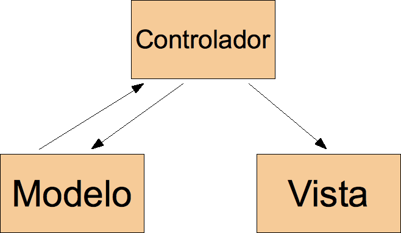

.. codeauthor:: Juan David Rodríguez García <juandavid.rodriguez@ite.educacion.es>

Unidad 2: Desarrollo de una aplicación web siguiendo el patrón MVC
==================================================================

El patrón MVC en el desarrollo de aplicaciones web
--------------------------------------------------

Muchos de los problemas que aparecen  en la ingeniería del software son similares
en su estructura. Y, por tanto, se resuelven de manera parecida. A lo largo de la
historia  de  esta  disciplina  se  han elaborado  un  buen  número  de  esquemas
resolutivos que son conocidos con el nombre  des *patrones de diseño* [1]_ y cuyo
conocimiento y  aplicación son de  una inestimáble ayuda a  la hora de  diseñar y
construir una aplicación informática.

Posiblemente uno de los más conocidos y utilizados sea el patrón *"Modelo, Vista,
Controlador" (MVC)*,  que propone  organizar una aplicación  en tres  partes bien
diferenciadas y débilmente  acopladas entre sí, de manera que  los cambios que se
produzcan en  una no afecten demasiado  a las otras (idealmente  nada). El nombre
del patrón enumera cada una de las partes:

* **El Controlador**. En este artefacto se incluye todo lo referente a la lógica
  de control de la aplicación, que no tiene nada que ver con las características
  propias del negocio para el que se está construyendo la aplicación. En el caso
  de una aplicación web, un ejemplo sería la manipulación de la *request HTTP*.

* **El Modelo**. Donde se implementa todo lo relativo a la lógica de negocio,
  es decir, los aspectos particulares del problema que la aplicación resuelve.
  Si, por ejemplo estamos desarrollando un *blog*, un ejemplo sería una
  librería de funciones para la gestión de los comentarios.

* **La Vista**. Aquí se ubica el código encargado de "pintar" el resultado de 
  los procesos de la aplicación. En una aplicación web la vista se encarga de
  producir documentos *HTML*, *XML*, *JSON*, etcétera, con los datos que se hayan 
  calculado previamente en la aplicación.

Para que el conjunto funcione, las partes deben interaccionar entre sí. Y en 
este punto encontramos en la literatura distintas soluciones. La que proponemos
en este curso es la mostrada en la siguiente figura:

   
   Diagrama del modelo MVC

El controlador recibe la orden de entrada y se encarga de procesarla utilizando,
si es preciso, los servicios del modelo para ello. Una vez que ha realizado el
cálculo entrega los datos "crudos" a la vista y esta se encarga de decorarlos
adecuadamente. La característica más importante de esta solución es que la vista
nunca interacciona con el modelo.

Las aplicaciones web más típicas pueden plantearse según este patrón: el 
controlador recibe una petición *HTTP* y la procesa, haciendo uso del modelo
calcula los datos de salida y los entrega a la vista, la cual se encarga de
construir una respuesta *HTTP* con las cabeceras adecuadas y un **payload** o
cuerpo de la respuesta que suele ser un contenido *HTML*, *XML* o *JSON*.

Aunque no todas las aplicaciones web se pueden ajustar a este modelo, si es
cierto que la idea de separar responsabilidades o las distintas areas de un
problema en sistemas débilmente acoplados, es una estrategia común en las
metodología que utilizan el paradigma de programación orientado a objetos. Es
lo que se conoce en la terminología anglosajona como *Separation Of Concerns* [2]_.

En esta unidad vamos a plantear y desarrollar una sencilla aplicación web
utilizando como guía de diseño este patrón. De esta manera ilustraremos sus
ventajas y nos servirá como material introductorio a la arquitectura de
*symfony 1.4*.

Descripción de la aplicación
----------------------------

Vamos a construir una aplicación web para elaborar y consultar un repositorio
de alimentos con datos acerca de sus propiedades dietéticas. Utilizaremos una
base de datos para almacenar dichos datos que consistirá en una sola tabla con
la siguiente información sobre alimentos:

* El nombre del alimento,
* la energía en kilocalorías ,
* la cantidad de proteínas,
* la cantidad hidratos de carbono  en gramos
* la cantidad de fibra en gramos  y 
* la cantidad de grasa en gramos,

todo ello por cada 100 gramos de alimento.

Aunque se trata de una aplicación muy sencilla,  cuenta con los elementos
suficientes para trabajar  el aspecto que realmente pretendemos estudiar en esta
unidad: la organización del código siguiendo las directrices del patrón *MVC*.
Comprobaremos como esta estrategia nos ayuda a mejorar las posibilidades de 
crecimiento (escalabilidad) y el mantenimiento de las aplicaciones que 
desarrollamos.

Diseño de la aplicación (I). Organización de los archivos
---------------------------------------------------------

La "anatomía" de una aplicación web típica consiste en:

1. El código que será procesado en el servidor (*PHP*, *Java*, *Python*, etcétera)
   para construir dinámicamente la respuesta.

2. Los *Assets*, que podemos traducir como "activos" de la aplicación, y que lo 
   constituyen todos aquellos archivos que se sirven directamente sin ningún
   tipo de proceso. Suelen ser imágenes, *CSS's* y código *Javascript*.

El servidor web únicamente puede acceder a una parte del sistema de ficheros 
que se denomina *Document Root*. Es ahí donde se buscan los recursos cuando se 
realiza una petición a la raíz del servidor a través de la URL 
``http://el.servidor.que.sea/``. Sin embargo, el código ejecutado para 
construir dinámicamente la respuesta puede "vivir" en cualquier otra parte, 
fuera del *Document root* [3]_.

Tode esto sugiere una manera de organizar el código de la aplicación para 
que no se pueda acceder desde el navegador más que al código estrictamente 
imprescindible para que esta funcione. Se trata, simplemente, de colocar en el
**Document root** sólo los activos y los scripts *PHP* de entrada a la aplicación. 
El resto de archivos, fundamentalmente librerías *PHP's* y ficheros de
configuración (XML, YAML, JSON, etcétera), se ubicarán fuera del **Document Root**
y serán incluidos por los scripts de inicio según lo requieran.

Siguiendo estas conclusiones, nuestra aplicación presentará la siguiente 
estructura de directorio:

.. code-block:: bash

   .
   ├── app
   └── web
       ├── css
       ├── images
       └── js

Configuraremos nuestro servidor web para que el directorio ``web`` sea su
*Document root*, y en ``app`` colocaremos el código *PHP* y la configuración de 
la aplicación.

Diseño de la aplicación (II). El controlador frontal 
----------------------------------------------------

La manera más directa y *naïf* de construir una aplicación en *PHP* consiste
en escribir un script *PHP* para cada página de la aplicación. Sin embargo esta
práctica presenta algunos problemas, especialmente cuando la aplicación que 
desarrollamos adquiere cierto tamaño y pretendemos que siga creciendo. Veamos
algunos de los problemas más significativos de este planteamiento.

Por lo general, todos los scripts de una aplicación realizan una serie de 
tareas que son comunes. Por ejemplo: interpretar y manipular  la *request*,
comprobar las credenciales de seguridad y cargar la configuración. Esto 
significa que una buena parte del código puede ser compartido entre los
scripts. Para ello podemos utilizar el mecanismo de inclusión de ficheros de *PHP*
y fin de la historia. Pero, ¿qué ocurre si en un momento dado, cuando ya tengamos
escrito mucho código, queremos añadir a todas las páginas de la aplicación una
nueva característica que requiere, por ejemplo, el uso de una nueva librería?.
Tenemos, entonces, que añadir dicha modificación a todos los scripts *PHP* de la
aplicación. Lo cual supone una degradación en el mantenimiento y un motivo
que aumenta la probabilidad de fallos una vez que el cambio se haya realizado.

Otro problema que ocurre con esta estrategia es que si se solicita una página
que no tiene ningún script *PHP* asociado, el servidor arrojará un error (404 
Not Found) cuyo aspecto no podemos controlar dentro de la propia aplicación 
(es decir, sin tocar la configuración del servidor web).

Como se suele decir, ¡a grandes males grandes remedios!; si el problema lo
genera el hecho de tener muchos scripts, que además comparten bastante código,
utilicemos uno solo que se encargue de procesar todas las peticiones. A este
único script de entrada se le conoce como **controlador frontal**.

Entonces, ¿cómo puedo crear muchas páginas distintas con un solo script?. La
clave está en utilizar la *query string* de la URL como parte de la ruta que
define la página que se solicita. El controlador frontal, en función
de los parámetro que lleguen en la *query string* determinará que acciones 
debe realizar para construir la página solicidada. 

.. note:: 
   
   La **query string** es la parte de la URL que contiene los datos que se
   pasarán a la aplicación web. Por ejemlo, en:
   ``http://tu.servidor/index.php?accion=hola``, la **query string** es:
   ``?accion=hola``.

Construcción de la aplicación. Vamos al lío.
--------------------------------------------

Pues eso, vamos al lío aplicando todo lo que llevamos dicho hasta el momento:

* El patrón de diseño *MVC*,

* La estructura de directorios que expone únicamente los ficheros 
  indispensables para el servidor web y,

* La idea de que todas la peticiones pasen por un solo script, el controlador
  frontal

Creación de la estructura de directorios
----------------------------------------

Comenzamos creando la estructura de directorios propuesta anteriormente. Por
lo pronto, en nuestro entorno de desarrollo y por cuestiones de comodidad,
crearemos la estructura en alguna ubicación dentro del **Document root**.

.. note::

   Si estás utilizando como sistema operativo *Ubuntu*, el **Document root** se
   encuentra en ``/var/www``, es ahí donde debes crear un directorio denominado 
   ``alimentos`` que alojará la estructura propuesta. Si estás utilizando *XAMP*
   en *Windows*, se encuentra en ``C:/xampp/htdocs``.
   
   Es importante resaltar que esto no debería hacerse en un entorno de
   producción, ya que dejamos al servidor web acceder directamente al
   directorio ``app``, y es algo que deseamos evitar. Sin embargo, de esta
   manera podemos añadir todos los proyectos que queramos sin tener que tocar
   la configuración del servidor web. Lo cual es algo muy agradecido cuando
   se está desarrollando.  En un entorno de producción debemos  asegurarnos de
   que el directorio ``web`` es el  **Document root** del servidor (o del
   VirtualHost de nuestra aplicación, si es que estamos alojando varias
   webs en un mismo servidor).

Nuestra implementación del patrón *MVC* será muy sencilla; crearemos una clase
para la parte del controlador que denominaremos ``Controller``, otra para
el modelo que denominaremos ``Model``, y para los parámetros de configuración
de la aplicación utilizaremos una clase que llamaremos ``Config``. Los archivos
donde se definen estas clases los ubicaremos en  el directorio ``app``. Por otro 
lado las Vistas serán implementadas como plantillas *PHP* en el directorio 
``app/templates``.

Los archivos *CSS*, *Javascript* , las imágenes y el controlador frontal los 
colocaremos en el directorio web. 

Cuando terminemos de codificar, la estructura de ficheros de la aplicación 
presentará el siguiente aspecto:

.. code-block:: bash

      /var/www/alimentos      
               ├── app
               |   ├── templates
               |   ├── Controllers.php
               |   ├── Model.php
               |   └── Config.php
               |
               └── web
                   ├── css
                   ├── images
                   ├── js
                   └── index.php

El controlador frontal y el mapeo de rutas
------------------------------------------

En cualquier aplicación web se deben definir las *URL's* asociadas a cada una de 
sus páginas. Para la nuestra definiremos las siguientes:

===================================================  =======================
URL                                                  Acción
===================================================  =======================
http://tu.servidor/alimentos/index.php?ctl=inicio    mostrar pantalla inicio
http://tu.servidor/alimentos/index.php?ctl=listar    listar alimentos
http://tu.servidor/alimentos/index.php?ctl=insertar  insertar un alimento
http://tu.servidor/alimentos/index.php?ctl=buscar    buscar alimentos
http://tu.servidor/alimentos/index.php?ctl=ver&id=x  ver el alimento *x*
===================================================  =======================

A cada una de estas *URL's* les vamos a asociar un método público de la clase
``Controller``. Estos métodos se suelen denominar **acciones**. Cada **acción**
se encarga de calcular dinámicamente los datos requeridos para construir su 
página. Podrá utilizar, si le hace falta, lo servicios de la clase ``Model``. Una
vez calculados los datos, se los pasará a una plantilla donde se realizará, 
finalmente, la construcción del documento *HTML* que será devuelto al cliente. 

Todos estos elementos serán "orquestados" por el controlador frontal, el cual
lo implementaremos en un script llamado ``index.php`` ubicado en el directorio
``web``. En concreto, la responsabilidad del controlador frontal será: 

* cargar la configuración del proyecto y las librerías donde implementaremos
  la parte del Modelo, del Controlador y de la Vista. 

* Analizar los parámetros de la petición *HTTP* (**request**) comprobando si
  la página solicitada en ella tiene asignada alguna acción del Controlador.
  Si es así la ejecutará, si no dará un error 404 (**page not found**).
  
Llegados a este punto es importante aclara que, el **controlador** frontal
y la clase ``Controller``, son distintas cosas y tienen distintas 
responsabilidades. El hecho de que ambos se llamen *controladores* puede dar
lugar a confusiones.

El controlador frontal tiene el siguiente aspecto. Crea el archivo 
``web/index.php`` y copia el siguiente código.

.. code-block:: php
   :linenos:
   
    <?php
    // web/index.php
    
    // carga del modelo y los controladores
    require_once __DIR__ . '/../app/Config.php';
    require_once __DIR__ . '/../app/Model.php';
    require_once __DIR__ . '/../app/Controller.php';
    
    // enrutamiento
    $map = array(
        'inicio' => array('controller' =>'Controller', 'action' =>'inicio'),
        'listar' => array('controller' =>'Controller', 'action' =>'listar'),
        'insertar' => array('controller' =>'Controller', 'action' =>'insertar'),
        'buscar' => array('controller' =>'Controller', 'action' =>'buscarPorNombre'),
        'ver' => array('controller' =>'Controller', 'action' =>'ver')
    );
    
    // Parseo de la ruta
    if (isset($_GET['ctl'])) {
        if (isset($map[$_GET['ctl']])) {
            $ruta = $_GET['ctl'];
        } else {
            header('Status: 404 Not Found');
            echo '<html><body><h1>Error 404: No existe la ruta <i>' . 
                    $_GET['ctl'] . 
                    '
</body></html>';
            exit;
        }
    } else {
        $ruta = 'inicio';
    }
    
    $controlador = $map[$ruta];
    // Ejecución del controlador asociado a la ruta
    
    if (method_exists($controlador['controller'],$controlador['action'])) {
        call_user_func(array(new $controlador['controller'], $controlador['action']));
    } else {
    
        header('Status: 404 Not Found');
        echo '<html><body><h1>Error 404: El controlador <i>' .
                $controlador['controller'] .
                '->' .
                $controlador['action'] .
                '</i> no existe</h1></body></html>';
    }

* En las líneas 5-7 se realiza la carga de la configuración del modelo y de los 
  controladores.
  
* En las líneas 10-16 se declara un array asociativo cuya función es definir una
  tabla para mapear (asociar), rutas en acciones de un controlador. Esta tabla 
  será utilizada a continuación para saber qué acción se debe disparar.
  
* En las líneas 19-31 se lleva a cabo el parseo de la *URL* y la carga de la
  acción, si la ruta está definida en la tabla de rutas. En caso contrario se 
  devuelve una página de error. Observa que hemos utilizado la función
  ``header()`` de *PHP* para indicar en la cabecera *HTTP* el código de error 
  correcto. Además enviamos un pequeño documento *HTML* que informa del error.
  También definimos a ``inicio`` como una ruta por defecto, ya que si la 
  **query string** llega vacía, se opta por cargar esta acción.
  
.. note::

   En honor a la verdad tenemos que decir que lo que estamos llamando parseo de 
   la *URL*, no es tal. Simplemente estamos extrayendo el valor de la variable
   ``ctl`` que se ha pasado a través de la petición *HTTP*. Sin embargo, hemos 
   utilizado este termino porque lo ideal sería que, en lugar de utilizar 
   parámetros de la petición *HTTP* para resolver la ruta, pudiésemos utilizar
   rutas *limpias* (es decir, sin caracteres ``?`` ni ``&`` ) del tipo:
   
   .. code-block:: bash
      
      http://tu.servidor/index.php/inicio
      http://tu.servidor/index.php/buscar
      http://tu.servidor/index.php/ver/5
  
   En este caso sí es necesario proceder a un parseo de la *URL* para buscar en la
   tabla de rutas la acción que le corresponde. Esto, obviamente, es más complejo.
   Pero es lo que hace (y muchas cosas más) el componente *Routing* de *symfony 1.4*.
   
Las acciones del Controlador. La clase ``Controller``.
------------------------------------------------------

Ahora vamos a implementar las acciones asociadas a las *URL's* en la clase 
``Controllers``. Crea el archivo ``app/Controller.php`` y copia el siguiente
código:

.. code-block:: php
   :linenos:
   
    <?php   
    
    class Controller
    {
    
        public function inicio()
        {
            $params = array(
                'mensaje' => 'Bienvenido al curso de symfony 1.4',
                'fecha' => date('d-m-yyy'),
            );
            require __DIR__ . '/templates/inicio.php';
        }
    
        public function listar()
        {
            $m = new Model(Config::$mvc_bd_nombre, Config::$mvc_bd_usuario,
                        Config::$mvc_bd_clave, Config::$mvc_bd_hostname);
    
            $params = array(
                'alimentos' => $m->dameAlimentos(),
            );
    
            require __DIR__ . '/templates/mostrarAlimentos.php';
        }
    
        public function insertar()
        {
            $params = array(
                'nombre' => '',
                'energia' => '',
                'proteina' => '',
                'hc' => '',
                'fibra' => '',
                'grasa' => '',
            );
    
            $m = new Model(Config::$mvc_bd_nombre, Config::$mvc_bd_usuario,
                        Config::$mvc_bd_clave, Config::$mvc_bd_hostname);
    
            if ($_SERVER['REQUEST_METHOD'] == 'POST') {
    
                // comprobar campos formulario
                if ($m->validarDatos($_POST['nombre'], $_POST['energia'],
                         $_POST['proteina'], $_POST['hc'], $_POST['fibra'], 
                         $_POST['grasa'])) {
                    $m->insertarAlimento($_POST['nombre'], $_POST['energia'],
                              $_POST['proteina'], $_POST['hc'], $_POST['fibra'],
                              $_POST['grasa']);
                    header('Location: index.php?ctl=listar');
                    
                } else {
                    $params = array(
                        'nombre' => $_POST['nombre'],
                        'energia' => $_POST['energia'],
                        'proteina' => $_POST['proteina'],
                        'hc' => $_POST['hc'],
                        'fibra' => $_POST['fibra'],
                        'grasa' => $_POST['grasa'],
                    );
                    $params['mensaje'] = 'No se ha podido insertar el alimento. Revisa el formulario';
                }
            }
    
            require __DIR__ . '/templates/formInsertar.php';
        }
    
        public function buscarPorNombre()
        {
            $params = array(
                'nombre' => '',
                'resultado' => array(),
            );
    
            $m = new Model(Config::$mvc_bd_nombre, Config::$mvc_bd_usuario,
                        Config::$mvc_bd_clave, Config::$mvc_bd_hostname);
    
            if ($_SERVER['REQUEST_METHOD'] == 'POST') {
                $params['nombre'] = $_POST['nombre'];
                $params['resultado'] = $m->buscarAlimentosPorNombre($_POST['nombre']);
            }
    
            require __DIR__ . '/templates/buscarPorNombre.php';
        }
    
        public function ver()
        {
            if (!isset($_GET['id'])) {
                throw new Exception('Página no encontrada');
            }
    
            $id = $_GET['id'];
    
            $m = new Model(Config::$mvc_bd_nombre, Config::$mvc_bd_usuario,
                        Config::$mvc_bd_clave, Config::$mvc_bd_hostname);
    
            $alimento = $m->dameAlimento($id);
    
            $params = $alimento;
    
            require __DIR__ . '/templates/verAlimento.php';
        }
    
    }

Esta  clase  implementa una  serie  de  métodos  públicos, que  hemos  denominado
acciones para  indicar que son métodos  asociados a *URL's*. Fíjate  como en cada
una de las acciones  se declara un array asociativo ( ``params``  ) con los datos
que serán pintados en la plantilla. Pero en ningún caso hay información acerca de
como se pintarán dichos datos. Por otro lado, casi todas las acciones utilizan un
objeto de la clase ``Models`` para  realizar operaciones relativas a la lógica de
negocio, en  nuestro caso  a todo lo  relativo con la  gestión de  los alimentos.

Para comprender  el funcionamiento  de las acciones,  comencemos por  Analizar la
función ``listar()`` .  Comienza declarando un objeto del modelo  (línea 17) para
pedirle posteriormente el conjunto de alimentos  almacenados en la base de datos.
Los datos recopilados  son almacenados en el array  asociativo ``params`` (líneas
20-22). Por último incluye  el archivo ``/templates/mostrarAlimentos.php`` (línea
24). Tal archivo,  que denominamos **plantilla**, será el  encargado de construir
el documento  *HTML* con los  datos del array  ``params``. Observa que  todas las
acciones tienen la misma estructura: realizan operaciones, recojen datos y llaman
a una plantilla para construir el  documento *HTML* que será devuelto al cliente.

Observa también que en las acciones  del controlador no hay ninguna operación que
tenga que ver con la lógica de negocio, todo lo que se hace es lógica de control.

Analicemos ahora  la acción  ``insertar()``, cuya  lógica de  control es  algo más
compleja     debido     a     que      tiene     una     doble     funcionalidad:

1. Enviar al cliente un formulario HTML,

2. Validar los datos sobre un alimento que se reciben desde el cliente para 
   insertarlos en la base de datos.

La  función comienza  por  declarar un  array asociativo  con  campos vacíos  que
coinciden con los  de la tabla alimento (líneas 29-36).  A continuación comprueba
si la petición se ha realizado mediante la operación *POST* (línea 41), si es así
significa que se han pasado datos a través  de un formulario, si no es así quiere
decir  que simplemente  se ha  solicitado  la página  para ver  el formulario  de
inserción.  En  este último  caso,  la  acción  pasa  directamente a  incluir  la
plantilla que  pinta el formulario (línea  65). Como el array  de parámetros está
vacío, se enviará al cliente un formulario  con los campos vacíos (cuando veas el
código de la plantilla lo verás en directo,  por lo pronto basta con saber que es
así).

Por otro lado,  si la petición a  la acción ``insertar()`` se ha  hecho mediante la
operación *POST*,  significa que se han  enviado datos de un  formulario desde el
cliente  (precisamente  del formulario  vacío  que  hemos  descrito un  poco  más
arriba).  Entonces se  extraen los  datos  de la  petición, se  comprueba si  son
válidos  (línea 44)  y  en su  caso  se realiza  la inserción  (línea  47) y  una
redirección al  listado de  alimentos (línea  50). Si los  datos no  son válidos,
entonces se rellena el  array de parámetros con los datos  de la petición (líneas
53-60) y se vuelve  a pintar el formulario, esta vez con  los campos rellenos con
los valores que  se enviaron en la  petición anterior y con un  mensaje de error.

Todo el  proceso que acabamos de  contar no tiene nada  que ver con la  lógica de
negocio;  esto es,  no  decide cómo  deben  validarse los  datos,  ni cómo  deben
insertarse  en la  base de  datos,  esas tareas  recaen  en el  modelo (el  cual,
obviamente debemos utilizar). Lo importante aquí  es que debe haber una operación
de  validación  para  tomar  una  decisión: insertar  los  datos  o  reenviar  el
formulario relleno con los datos que envió  el usuario y con un mensaje de error.
Es  decir,   únicamente  hay  código   que  implementa  la  lógica   de  control.

.. note::

   El esquema de control que se acaba de presentar resulta muy práctico y ordenado
   para implementar acciones que consisten en recopilar datos del usuario y
   realizar algún proceso con ellos (almacenarlos en una base de datos, por 
   ejemplo). A lo largo del curso aparecerá, con más o menos variaciones, en 
   varias ocasiones.

La implementación de la Vista. 
------------------------------

Las plantillas *PHP*
^^^^^^^^^^^^^^^^^^^^

Ahora vamos a pasar a estudiar la parte de la Vista, representada en nuestra 
solución por las plantillas. Aunque en el análisis que estamos haciendo ya hemos
utilizado la palabra "plantilla" en varias ocasiones, aún no la hemos definido con
precisión. Así que comenzamos por ahí.

Una plantilla es un fichero de texto con la información necesaria para generar
documentos en cualquier formato de texto (*HTML*, *XML*, *CSV*, *LaTeX*, *JSON*,
etcétera). Cualquier tipo de plantilla consiste en un documento con el formato que
se quiere generar, y con variables expresadas en el lenguaje propio de la
plantilla y que representas a lo valores que son calculados dinámicamente por la
aplicación.

Cuando desarrollamos aplicaciones web con *PHP*, la forma más sencilla de 
implementar plantillas es usando el propio *PHP* como lenguaje de plantillas. ¿Qué
significa esto? Acudimos al refranero popular y decimos aquello de que *una imagen
vale más que mil palabras*. Con todos vosotros un ejemplo de plantilla *HTML* que
usa *PHP* como lenguaje de plantillas (dedícale un ratito a observarla y 
analizarla, ¿qué es lo que te llama la atención en el aspecto del código *PHP*
que aparece?)

.. code-block:: html+php
   :linenos:

	<table>
	    <tr>
		<th>alimento (por 100g)</th>
		<th>energía (Kcal)</th>
		<th>grasa (g)</th>
	    </tr>
	    <?php foreach ($params['alimentos'] as $alimento) :?>
	    <tr>
		<td><a href="index.php?ctl=ver&id=<?php echo $alimento['id']?>">
                       <?php echo $alimento['nombre'] ?>
                    </a>
            </td>
		<td><?php echo $alimento['energia']?></td>
		<td><?php echo $alimento['grasatotal']?></td>
	    </tr>
	    <?php endforeach; ?>

	</table>

Esencialmente no es más que un trozo de documento *HTML* donde la información 
dinámica se obtiene procesando código *PHP*. La característica principal de este
código *PHP* es que debe ser escueto y corto. De manera que no "contamine" la
estructura del *HTML*. Por ello cada instrucción *PHP* comienza y termina en la
misma línea. La mayor parte de estas instrucciones son ``echo's`` de variables
escalares. Pero también son muy usuales la utilización de bucles ``foreach`` - 
``endforeach`` para recorrer arrays de datos, así como los bloques condicionales
``if`` - ``endif`` para pintar bloques según determinadas condiciones.

En el ejemplo de más arriba se genera el código *HTML* de una tabla que puede tener
un número variable de filas. Se recoje en la plantilla el parámetro ``alimentos`` ,
que es un array con datos de alimentos, y se genera una fila por cada elemento del
array con información de la *URL* de una página sobre el alimento (línea 9), y 
su nombre, energía y grasa total (líneas 10-14).

Observa también la forma de construir el bucle ``foreach``, se abre en la línea 7 
y se cierra en la 16. Lo particular de la sintaxis de este tipo de bucle para 
plantillas es que la instrucción ``foreach`` que lo abre terminan con el caracter 
``:``. Y la necesidad de cerrarlo con un ``<?php endforeach; ?>``.

El layout y el proceso de *decoración de plantillas*
^^^^^^^^^^^^^^^^^^^^^^^^^^^^^^^^^^^^^^^^^^^^^^^^^^^^

En una aplicación web,  muchas de las páginas tienen elementos comunes. Por 
ejemplo, un caso típico es la cabecera donde se coloca el mensaje de bienvenida, 
el menú y el pie de página. Este hecho, y la aplicación del conocido principio de
buenas prácticas de programación *DRY* (*Don't Repeat Yourself*, No Te Repitas),
lleva a que cualquier sistema de plantillas que se utilice para implementar la 
vista utilice otro conocido patrón de diseño: El *Decorator*, o Decorador [4]_.
Aplicado a la generación de vistas la solución que ofrece dicho patrón es la de
añadir funcionalidad adicional a las plantillas. Por ejemplo, añadir el menú y el
pie de página a las plantillas que lo requieran, de manera que dichos elementos 
puedan reutilizarse en distintas plantillas. Literalmente se trata de *decorar* 
las plantillas con elementos adicionales reutilizables. 

Nuestra implementación del patrón *Decorator* es muy simple y, por tanto limitada,
pero suficiente para asimilar las bases del concepto y ayudarnos a comprender más
adelante la filosofía del sistema de plantillas de *symfony 1.4*.

Nuestras plantillas serán ficheros *PHP* del tipo que acabamos de explicar, y las 
ubicaremos en el directorio ``app/templates``. Como ya has visto en el código del 
controlador, las acciones finalizan incluyendo alguno de estos archivos. Comencemos
por estudiar  la plantilla ``app/templates/mostrarAlimentos.php``, que es la 
que utiliza la acción ``listar()`` para pintar los alimentos que obtiene del
modelo. Crea el archivo ``app/templates/mostrarAlimentos.php`` con el siguiente
código:

``app/templates/mostrarAlimentos.php``

.. code-block:: html+php
   :linenos:
   
    <?php ob_start() ?>
    
    <table>
        <tr>
            <th>alimento (por 100g)</th>
            <th>energía (Kcal)</th>
            <th>grasa (g)</th>
        </tr>
        <?php foreach ($params['alimentos'] as $alimento) :?>
        <tr>
            <td><a href="index.php?ctl=ver&id=<?php echo $alimento['id']?>">
                    <?php echo $alimento['nombre'] ?></a></td>
            <td><?php echo $alimento['energia']?></td>
            <td><?php echo $alimento['grasatotal']?></td>
        </tr>
        <?php endforeach; ?>
    
    </table>
    
    
    <?php $contenido = ob_get_clean() ?>
    
    <?php include 'layout.php' ?>

Como ves, las líneas 3-18 son las que se han puesto como ejemplo de plantilla *PHP*
hace un momento. La novedad son las líneas 1 y 21-23. En ellas está la clave del
nuestro proceso de decoración. Para comprenderlo del todo es importante echarle
un vistazo al fichero ``app/templates/layout.php``, incluido al final de la 
plantilla. Créalo y copia el siguiente código:

``app/templates/layout.php``

.. code-block:: html+php
   :linenos:
   
    <!DOCTYPE HTML PUBLIC "-//W3C//DTD HTML 4.01 Transitional//EN">
    <html>
        <head>
            <title>Información Alimentos</title>
            <meta http-equiv="Content-Type" content="text/html; charset=UTF-8">
            <link rel="stylesheet" type="text/css" href="<?php echo 'css/'.Config::$mvc_vis_css ?>" />
    
        </head>
        <body>
            

                <h1>Información de alimentos</h1>
            

    
            

                

                <a href="index.php?ctl=inicio">inicio</a> |
                <a href="index.php?ctl=listar">ver alimentos</a> |
                <a href="index.php?ctl=insertar">insertar alimento</a> |
                <a href="index.php?ctl=buscar">buscar por nombre</a> |
                <a href="index.php?ctl=buscarAlimentosPorEnergia">buscar por energia</a> |
                <a href="index.php?ctl=buscarAlimentosCombinada">búsqueda combinada</a>
                

            

    
            

                <?php echo $contenido ?>
            

    
            

                

                
- pie de página -

            

        </body>
    </html>

El nombre del fichero es bastante ilustrativo, es un *layout* *HTML*, es decir, un
diseño de un documento *HTML* que incluye como elemento dinámico a la variable 
``$contenido`` (línea 26), la cual esta definida al final de la plantilla 
``mostrarAlimentos.php``, y cuyo contenido es precisamente el resultado de 
interpretar las líneas comprendidas entre el ``ob_start()``  y 
``$contenido = ob_get_clean()`` . En la documentación de estas funciones
(http://php.net/manual/es/function.ob-start.php) puedes ver que el 
efecto de ``ob_start()`` es enviar todos los resultados del script desde la 
invocación de la función a un buffer interno. Dichos resultados se recojen a
través de la función ``ob_get_clean()`` . De esa manera conseguimos decorar la 
plantilla con el layout. Esta técnica es utilizada en todas las plantillas, de 
manera que todos los elementos comunes a todas las páginas son escritos una
sóla vez en ``layout.php`` y reutilizados con todas las plantillas generadas con
los datos de cada acción.

Observa que el *layout* que hemos propuesto incluye:

* los estilos *CSS* (línea 6),

* el menú de la aplicación (líneas 14-23)

* el pie de página (líneas 29-32) 

A continuación mostramos el código del resto de las plantillas:

``app/templates/inicio.php``

.. code-block:: html+php
   :linenos:
    
    <?php ob_start() ?>
    <h1>Inicio</h1>
    <h3> Fecha: <?php echo $params['fecha'] ?> </h3>
    <?php echo $params['mensaje'] ?>
    
    <?php $contenido = ob_get_clean() ?>
    
    <?php include 'layout.php' ?>

``app/templates/formInsertar.php``

.. code-block:: html+php
   :linenos:
    
    <?php ob_start() ?>
    
    <?php if(isset($params['mensaje'])) :?>
    <b><?php echo $params['mensaje'] ?></b>
    <?php endif; ?>
     
    <form name="formInsertar" action="index.php?ctl=insertar" method="POST">
        <table>
            <tr>
                <th>Nombre</th>
                <th>Energía (Kcal)</th>
                <th>Proteina (g)</th>
                <th>H. de carbono (g)</th>
                <th>Fibra (g)</th>
                <th>Grasa total (g)</th>
            </tr>
            <tr>
                <td><input type="text" name="nombre" value="<?php echo $params['nombre'] ?>" /></td>
                <td><input type="text" name="energia" value="<?php echo $params['energia'] ?>" /></td>
                <td><input type="text" name="proteina" value="<?php echo $params['proteina'] ?>" /></td>
                <td><input type="text" name="hc" value="<?php echo $params['hc'] ?>" /></td>
                <td><input type="text" name="fibra" value="<?php echo $params['fibra'] ?>" /></td>
                <td><input type="text" name="grasa" value="<?php echo $params['grasa'] ?>" /></td>
            </tr>
    
        </table>
        <input type="submit" value="insertar" name="insertar" />
    </form>
    * Los valores deben referirse a 100 g del alimento
    
    <?php $contenido = ob_get_clean() ?>
    
    <?php include 'layout.php' ?>
  
``app/templates/buscarPorNombre.php``

.. code-block:: html+php
   :linenos:
    
	<?php ob_start() ?>

	 <form name="formBusqueda" action="index.php?ctl=buscar" method="POST">

	     <table>
		 <tr>
		     <td>nombre alimento:</td>
		     <td><input type="text" name="nombre" value="<?php echo $params['nombre']?>">(puedes utilizar '%' como comodín)</td>

		     <td><input type="submit" value="buscar"></td>
		 </tr>
	     </table>

	     </table>

	 </form>

	 <?php if (count($params['resultado'])>0): ?>
	 <table>
	    <tr>
		<th>alimento (por 100g)</th>
		<th>energía (Kcal)</th>
		<th>grasa (g)</th>
	    </tr>
	    <?php foreach ($params['resultado'] as $alimento) : ?>
		<tr>
		    <td><a href="index.php?ctl=ver&id=<?php echo $alimento['id'] ?>">
			    <?php echo $alimento['nombre'] ?></a></td>
		    <td><?php echo $alimento['energia'] ?></td>
		    <td><?php echo $alimento['grasatotal'] ?></td>
		</tr>
	    <?php endforeach; ?>

	</table>
	 <?php endif; ?>

	 <?php $contenido = ob_get_clean() ?>

	 <?php include 'layout.php' ?>

``app/templates/verAlimento.php``

.. code-block:: html+php
   :linenos:
    
    <?php ob_start() ?>
    
    <h1><?php echo $params['nombre'] ?></h1>
    <table border="1">
        
        <tr>
            <td>Energía</td>
            <td><?php echo $alimento['energia'] ?></td>
            
        </tr>
        <tr>
            <td>Proteina</td>
            <td><?php echo $alimento['proteina']?></td>
            
        </tr>
        <tr>
            <td>Hidratos de Carbono</td>
            <td><?php echo $alimento['hidratocarbono']?></td>
            
        </tr>
        <tr>
            <td>Fibra</td>
            <td><?php echo $alimento['fibra']?></td>
            
        </tr>
        <tr>
            <td>Grasa total</td>
            <td><?php echo $alimento['grasatotal']?></td>
            
        </tr>
    
    </table>
    
    
    <?php $contenido = ob_get_clean() ?>
    
    <?php include 'layout.php' ?>

Todas las plantillas recurren al uso de las funciones ``ob_start()`` y 
``ob_get_clean()`` y a la inclusión del *layout* para realizar el proceso de 
decoración.

El Modelo. Accediendo a la base de datos
----------------------------------------

Ya sólo nos queda presentar al Modelo. En nuestra aplicación se ha implementado
en la clase ``Model`` y esta compuesto por una serie de funciones para 
persistir datos en la base de datos, recuperarlos y realizar su validación.

Dependiendo de la complejidad del negocio con el que tratemos, el modelo puede ser
más o menos complejo y, además de tratar con la persistencia de los datos puede
incluir funciones para ofrecer otros servicios relacionados con el negocio en 
cuestión. Crea el archivo ``app/Model.php`` y copia el siguiente código:

``app/Model.php``

.. code-block:: php
   :linenos:

    <?php
    
    class Model
    {
        protected $conexion;
    
        public function __construct($dbname,$dbuser,$dbpass,$dbhost)
        {   
          $mvc_bd_conexion = mysql_connect($dbhost, $dbuser, $dbpass);

          if (!$mvc_bd_conexion) {
              die('No ha sido posible realizar la conexión con la base de datos: ' . mysql_error());
          }
          mysql_select_db($dbname, $mvc_bd_conexion);

          mysql_set_charset('utf8');

          $this->conexion = $mvc_bd_conexion;
        }

    
    
        public function bd_conexion()
        {
            
        }
    
        public function dameAlimentos()
        {
            $sql = "select * from alimentos order by energia desc";
    
            $result = mysql_query($sql, $this->conexion);
    
            $alimentos = array();
            while ($row = mysql_fetch_assoc($result))
            {
                $alimentos[] = $row;
            }
    
            return $alimentos;
        }
    
        public function buscarAlimentosPorNombre($nombre)
        {
            $nombre = htmlspecialchars($nombre);
    
            $sql = "select * from alimentos where nombre like '" . $nombre . "' order by energia desc";
    
            $result = mysql_query($sql, $this->conexion);
    
            $alimentos = array();
            while ($row = mysql_fetch_assoc($result))
            {
                $alimentos[] = $row;
            }
    
            return $alimentos;
        }
        
        public function dameAlimento($id)
        {
            $id = htmlspecialchars($id);
            
            $sql = "select * from alimentos where id=".$id;
            
            $result = mysql_query($sql, $this->conexion);
    
            $alimentos = array();
            $row = mysql_fetch_assoc($result);
            
            return $row;
            
        }
    
        public function insertarAlimento($n, $e, $p, $hc, $f, $g)
        {
            $n = htmlspecialchars($n);
            $e = htmlspecialchars($e);
            $p = htmlspecialchars($p);
            $hc = htmlspecialchars($hc);
            $f = htmlspecialchars($f);
            $g = htmlspecialchars($g);
    
            $sql = "insert into alimentos (nombre, energia, proteina, hidratocarbono, fibra, grasatotal) values ('" .
                    $n . "'," . $e . "," . $p . "," . $hc . "," . $f . "," . $g . ")";
    
            $result = mysql_query($sql, $this->conexion);
    
            return $result;
        }
        
        public function validarDatos($n, $e, $p, $hc, $f, $g)
        {
            return (is_string($n) &
                    is_numeric($e) &
                    is_numeric($p) &
                    is_numeric($hc) &
                    is_numeric($f) &
                    is_numeric($g));
        }
    
    }

Cuando el controlador requiere el uso del modelo, creamos un objeto de tipo 
``$m = new Model()`` . El constructor de esta clase realiza una conexión con
la base de datos y la pone disponible a todos sus métodos al añadir la conexión
creada como atributo del objeto. Cada función utiliza esta conexión para 
realizar su cometido contra la base de datos.

La última función de la clase, ``validarDatos()``, es algo distinta, ya que no
utiliza para nada la conexión con la base de datos. Simplemente valida datos. 
Si la aplicación fuera más compleja sería interesante crear una clase dedicada
a la validación. De manera que atendamos al principio de la *Separation of
Concerns* .

La configuración de la aplicación
---------------------------------

A lo largo y ancho de todo el código expuesto, aparece cada tanto una referencia a
unos atributos estáticos de la clase ``Config`` . Por ejemplo, en la línea 10 del
archivo ``app/Model.php``, aparece ``Config::$mvc_bd_hostname``, 
``Config::$mvc_bd_usuario``, etcétera. Se trata de parámetros de configuración que
hemos definido en una clase denominada ``Config``:

``app/Config.php``

.. code-block:: php
   :linenos:
   
    <?php

    class Config
    {
        static public $mvc_bd_hostname = "localhost";
        static public $mvc_bd_nombre   = "alimentos";
        static public $mvc_bd_usuario  = "root";
        static public $mvc_bd_clave    = "root";
        static public $mvc_vis_css     = "estilo.css";
    }
    
Esta clase está disponible durante todo el script de manera que se pueden utilizar
sus valores a lo largo del código, y cambiarlos sin más que modificar este
fichero.

Con esto ya tenemos todo el código de la parte de servidor. Ya sólo nos falta
darle un toque de estilo a los documentos *HTML* que enviamos al cliente y crear
la base de datos que almacenará los datos persistentes sobre los alimentos.

Incorporar las CSS's
--------------------

Crea el directorio ``web/css`` y en él coloca un archivo llamado ``estilo.css`` con
el siguiente contenido:

``web/css/estilo.css``

.. code-block:: css
   
    body {
      padding-left: 11em;
      font-family: Georgia, "Times New Roman",
            Times, serif;
      color: purple;
      background-color: #d8da3d }
    ul.navbar {
      list-style-type: none;
      padding: 0;
      margin: 0;
      position: absolute;
      top: 2em;
      left: 1em;
      width: 9em }
    h1 {
      font-family: Helvetica, Geneva, Arial,
            SunSans-Regular, sans-serif }
    ul.navbar li {
      background: white;
      margin: 0.5em 0;
      padding: 0.3em;
      border-right: 1em solid black }
    ul.navbar a {
      text-decoration: none }
    a:link {
      color: blue }
    a:visited {
      color: purple }
    address {
      margin-top: 1em;
      padding-top: 1em;
      border-top: thin dotted }
    #contenido {
      display: block;
      margin: auto;
      width: auto;
      min-height:400px;
    }

Fíjate que en el archivo ``app/templates/layout.php`` se incluye (línea 6) 
este archivo *CSS* que acabamos de crear. Como dicho *layout* decora a todas las 
plantillas, estos estilos afectarán a todas las páginas.

La base de datos
----------------

En el Sistema Gestor de Base de Datos *MySQL* que vayas a utilizar, utilizando
algún cliente *MySQL* crea una base de datos para almacenar los alimentos. 
Introduce algunos registros para probar la aplicación.

.. code-block:: sql
 
    CREATE TABLE `alimentos` (
      `id` int(11) NOT NULL AUTO_INCREMENT,
      `nombre` varchar(255) NOT NULL,
      `energia` decimal(10,0) NOT NULL,
      `proteina` decimal(10,0) NOT NULL,
      `hidratocarbono` decimal(10,0) NOT NULL,
      `fibra` decimal(10,0) NOT NULL,
      `grasatotal` decimal(10,0) NOT NULL,
      PRIMARY KEY (`id`)
    ) ENGINE=InnoDB  DEFAULT CHARSET=utf8;

Lo importante para que la conexión funcione, es que los parámetros de conexión
que se establecen en el fichero ``app/Config.php`` coincidan con los de tu 
base de datos. 

.. hint::
   
   Lo más cómodo para desarrollar es tener todo en el mismo computador: tanto el
   servidor web (*apache*) como el servidor de base de datos (*MySQL*). Además
   es muy práctico, aunque nada seguro, utilizar en el servidor *MySQL* el usuario
   ``root`` (superadministrador) como usuario de nuestras aplicaciones. Así no hay
   que preocuparse por temas de permisos. Repetimos: es lo más cómodo pero, a la
   vez, lo más inseguro. Esta práctica está justificada ÚNICAMENTE en un entorno
   de desarrollo en local, donde la seguridad, en principio no es primordial.

Ya puedes juntar todas las piezas y probar la aplicación introduciendo en tu 
navegador la *URL* correspondiente:

.. code-block:: bash
   
   http://tu.servidor/ruta/a/alimentos/web/index.php
   
¡Suerte!

Comentarios
-----------

Aquí puedes enviar comentarios, dudas y sugerencias. Utiliza la barra de *scroll* para
recorrer todos los mensajes. El formulario de envío se encuentra al final.

.. raw:: html

   <object type="text/html" width="100%" height="800" data="commentator/index.php?page=unidad2"></object>

------------

.. [1] "Patrones de Diseño" de los autores Erich Gamma, Richard Helm, Ralph
       Johnson y John Vlissides (conocidos como *The Gun of Four*) es un clásico
       en la literatura sobre este tema.

.. [2] http://en.wikipedia.org/wiki/Separation_of_concerns
       
.. [3] En el caso de *Apache* con *PHP*, que es el que nos interesa en este curso,
       el servidor debe estar configurado adecuadamente para que se puedan incluir
       archivos *PHP* que están fuera del *Document root**. Esto se hace con 
       la directiva ``open_basedir``.

.. [4] http://es.wikipedia.org/wiki/Decorator_%28patr%C3%B3n_de_dise%C3%B1o%29

-------------

.. raw:: html

   

   
    
   Desarrollo de Aplicaciones web con symfony 1.4 por Juan David Rodríguez García (juandavid.rodriguez@ite.educacion.es)
    
   se encuentra bajo una Licencia <a rel="license" href="http://creativecommons.org/licenses/by-nc-sa/3.0/">Creative Commons Reconocimiento-NoComercial-CompartirIgual 3.0 Unported</a>.
   </style>
   

