Unidad 4: Análisis de la aplicación “Gestor Documental”
=======================================================

Continuaremos el estudio de *symfony* desarrollando una aplicación *web* con 
unas funcionalidades que permitan aplicar la mayor parte de las herramientas 
que el *framework* ofrece. Tal aplicación requiere de un análisis previo que, 
mediante los modelos apropiados, describa con detalle las características de la 
misma. El primer objetivo de este capítulo es la exposición de dicho análisis. 

Por otra parte, cuando nos dispongamos a construir la aplicación *web* descrita
en el análisis y según los principios de diseño impuestos por el *framework
symfony*, necesitaremos utilizar una serie de recursos que  van más allá del
código fuente de las acciones y plantillas que conforman el grueso de la
aplicación. En concreto necesitaremos: 

* Unas *CSS's* para dotar de estilo a la aplicación.

* Un modelo de maquetación *HTML* para construir las plantillas y el *layout* 
  de la aplicación.

* Algunos recursos gráficos (logotipo, iconos, …)

Una base de datos con datos de ejemplo.

El segundo objetivo de esta unidad será construir los recursos que acabamos de
citar teniendo en cuenta los dictados del análisis de la aplicación. 

En definitiva, en esta unidad desarrollaremos el soporte teórico y los recursos
prácticos que necesitaremos en el resto del curso.

Descripción de la aplicación
----------------------------

Vamos a construir un *gestor documental multiusuario*, es decir una aplicación 
*web*  mediante la que los usuarios de la misma puedan almacenar y compartir 
ficheros, organizarlos, etiquetarlos, buscarlos y descargarlos. Se trata de una
herramienta muy útil en cualquier grupo de trabajo que produzca cierta cantidad 
de documentación.

Un equipo de desarrollo de *software* es un buen ejemplo de usuarios a los que
resultaría muy útil la aplicación. En efecto, el ciclo de desarrollo de *software*
pasa por varias fases a lo largo de las que se generan distintos tipos de 
documentos: análisis, diseños, manuales de usuario y otros tantos. Uno de los 
problemas más comunes es la organización y localización rápida de los documentos.
La aplicación que vamos a construir tiene como objetivo principal facilitar dicha 
tarea.

Existen varias soluciones profesionales en el mercado que cubren esta necesidad.
Las más conocidas son *Alfresco*, *Nuxeo* y *KnowledgeTree*, las dos primeras 
utilizan tecnología Java y se presentan como un *ECM* (*Entreprise Content
Management*) incluyendo el gestor de documentos como un componente más, mientras 
que la última se ha construido sobre *PHP* y se presenta exclusivamente como
gestor de documentos. Obviamente la aplicación que construiremos durante el resto 
del curso no pretende competir con ninguna de aquellas; nuestro propósito es 
fundamentalmente pedagógico. Sin embargo, tales aplicaciones profesionales nos
han servido como modelo para la extracción de los requisitos fundamentales de
nuestro desarrollo.

Por último hemos optado por un gestor documental como aplicación vertebradora 
del curso porque engloba un amplio conjunto de funcionalidades para tratar los
aspectos más relevantes de *symfony*. Además es una aplicación eminentemente
práctica, a pesar de que la hemos concebido desde una perspectiva pedagógica. De 
hecho, y gracias a las posibilidades de expansión de *symfony*, una vez finalizado
el curso, la aplicación puede ser mejorada, modificada y/o adaptada hasta el 
punto que uno desee. También podrá ser utilizada como modelo para el desarrollo
de otras aplicaciones que, en principio, no tienen nada que ver con la gestión 
de documentos; basta con que el programador tenga la suficiente capacidad de 
abstracción para identificar estructuras análogas en dominios distintos.

Catálogo de requisitos
----------------------

Hemos clasificado en 4 grupos los requisitos de la aplicación:

* Gestión de usuarios

* Gestión de documentos

* Gestión de comentarios y 

* Gestión de puntuaciones

Gestión de usuarios
^^^^^^^^^^^^^^^^^^^

======= =======================================================================
U.01    La aplicación contemplará 4 tipos de usuarios:

        * **invitado**, que podrá realizar búsquedas y descargas de documentos
          públicos.
        
        * **lector**, que podrá realizar búsquedas y descargas de todos los 
          documentos
        
        * **autor**, que además podrá subir documentos
        
        * **administrador**, que además podrá administrar todos los aspectos de
          la aplicación.

U.02    La aplicación presentará una parte pública (perfil invitado) en la que 
        cualquier persona podrá realizar búsquedas de documentos públicos. Para
        todas las demás acciones el usuario debe estar registrado.

U.03    Los usuarios registrados tendrán asociado un único perfil

U.04    La aplicación permitirá a los usuarios que dispongan del perfil 
        administrador gestionar los usuarios, esto es, darlos de alta, 
        modificarlos y eliminarlos. 

U.05    Se almacenarán los siguientes datos de los usuarios registrados:

        * nombre (requerido)
        
        * apellidos

        * nombre de usuario (requerido)

        * *password* con encriptación MD5 (requerido)

        * perfil

U.06    La aplicación presentará en la cabecera de cada pantalla el nombre y
        apellidos del usuario que la está utilizando, así como el perfil que  
        tiene asociado y un botón para salir de la misma.
======= =======================================================================

Gestión de documentos
^^^^^^^^^^^^^^^^^^^^^

======= =======================================================================
D.01    Por cuestiones de seguridad, la aplicación permitirá al administrador 
	decidir qué tipo de archivos se podrán subir al repositorio. Se 
	utilizará para ello la comprobación de tipos MIME.
		
D.02    Los documentos tendrán asociados los siguientes *metadatos*:

		* título
		
		* descripción
		
		* fecha de subida al servidor

		* autor del documento

		* ¿es público?

		* categorías
		
D.03    El administrador de la aplicación podrá añadir, modificar y eliminar 
	las categorías
		
D.04	Las versiones de los documentos, una vez subidas al servidor, no se 
	podrán borrar ni modificar
		
D.05	Los ficheros de las versiones deben ser del tipo indicado por el 
	documento al que pertenecen.
		
D.06	El autor podrá subir nuevas versiones de sus documentos. La numeración
	de las versiones será automática.
		
D.07	Cada autor tendrá asociado un directorio físico en el servidor donde 
	serán alojadas las versiones de sus documentos.
		
D.08	Las búsquedas podrán ser realizadas por título, descripción, tipo, 
	autor y categorías
		
D.09	Los resultados de las búsquedas se presentarán como listados paginados.
	Cada fila corresponderá a un documento y sobre la misma fila se 
	indicarán las operaciones que se pueden realizar sobre el documento en 
	función del perfil que esté registrado. Las operaciones son las 
	siguientes, entre paréntesis se muestran los perfiles que pueden
	realizarlas:

		* Descargar (lector, autor, administrador)

		* Subir nueva versión (autor, administrador)

		* Ver metadatos (todos los perfiles)

		* Modificar metadatos (autor, administrador)

======= =======================================================================

Comentarios
^^^^^^^^^^^

======= =======================================================================
C.01	Los usuarios registrados podrán enviar comentarios a los documentos.

C.02	Los usuarios registrados podrán ver los comentarios de los documentos.

C.03	Cada comentario consistirá en:

		* autor
		
		* fecha de publicación
		
		* texto del comentario (máximo 250 caracteres)
		
C.04	Los comentarios solo podrán ser borrados por el administrador y nunca 
		modificados.
======= =======================================================================

Puntuación
^^^^^^^^^^

======= =======================================================================
P.01	Los usuarios registrados podrán votar sólo una vez cada documento 
		consultado
		
P.02	La puntuación se hará de 1 a 10 sin decimales

P.03	La puntuación del artículo consistirá en la media aritmética de todas 
		las votaciones junto con el nº de votaciones que tiene.
		
P.04	Los listados de las búsquedas podrán ordenarse por puntuación.
======= =======================================================================

Modelo de datos.
----------------

La figura 1 representa mediante un diagrama de clases *UML* el modelo de datos 
que utilizaremos en el desarrollo de la aplicación y que satisface los requisitos
anteriores.

Los usuarios deben tener asociado un sólo perfil. Además podrán poseer ninguno, 
uno o varios documentos y podrán realizar ninguno, uno o varios comentarios a las 
versiones de los documentos almacenados de otros autores. Todo ello según las 
reglas especificadas en los requisitos.

Cada documento tiene asociado, como mínimo una versión (la primera), y puede
pertenecer a un número cualquiera de categorías. 

Las categorías se pueden asociar a cualquier número de documentos.

Cada versión tendrá asociada una votación que se calculará como se indica en los 
requisitos. Además se les puede asignar cualquier número de comentarios que, a su
vez, proceden de los usuarios.

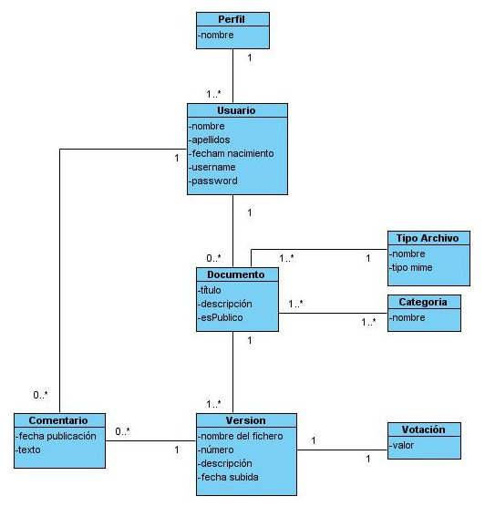
  
   Figura 1. Modelo de datos

Implementaremos este modelo en una base de datos según lo especificado en el 
diagrama *entidad-relación* de la figura 2. Buscando la simplificación por 
motivos pedagógicos, hemos sacrificado cierta flexibilidad y capacidad de 
crecimiento de la aplicación al considerar los perfiles como un campo de la
tabla *usuarios*, y las votaciones como un campo de la tabla *versiones*.

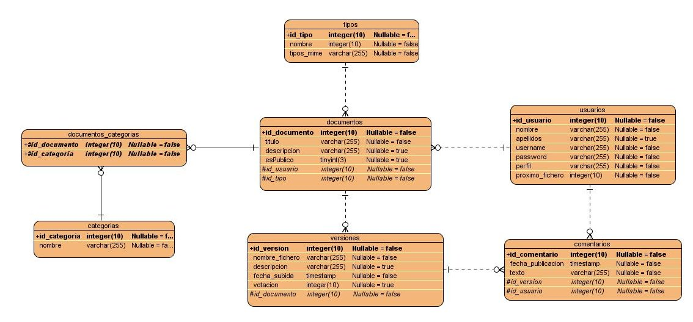
  
   Figura 2. Diagrama Entidad-Relación

Descripción del proceso de subida de archivos
---------------------------------------------

Es importante que no haya colisión en los nombres de los ficheros cuando sean
alojados en las carpetas asociadas a cada autor. Por ello hemos diseñado un
sencillo procedimiento para nombrar los ficheros enviados al servidor antes de
ser guardados en su carpeta correspondiente. Se trata de nombrarlos mediante una 
combinación de la fecha actual y una cadena generada aleatoriamente, manteniendo
la extensión original. Se trata de un sencillo proceso que garantiza la unicidad 
del nombre del fichero.

Una vez almacenado el fichero en la carpeta que le corresponde según su autor,
hay que actualizar la base de datos añadiendo un registro en la tabla *versiones*
con el nombre del fichero. Además, si se trata de la primera versión de un
documento también hay que insertar el registro correspondiente en la tabla
documentos con los *metadatos* que el usuario ha introducido en el formulario 
para la subida de documentos.

La figura 3 muestra un diagrama de actividad modela dicho proceso.

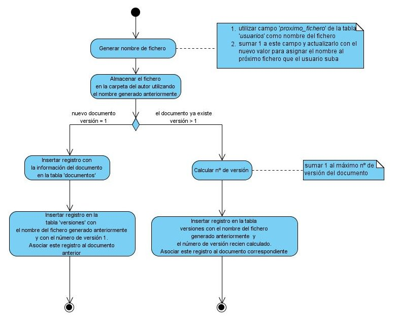
  
   Figura 3. Diagrama de actividad del proceso de subida de archivos

Escenarios
----------

En este apartado mostraremos mediante bocetos de pantallas, los distintos 
escenarios que presentará la aplicación.

Búsqueda y listado de documentos
^^^^^^^^^^^^^^^^^^^^^^^^^^^^^^^^

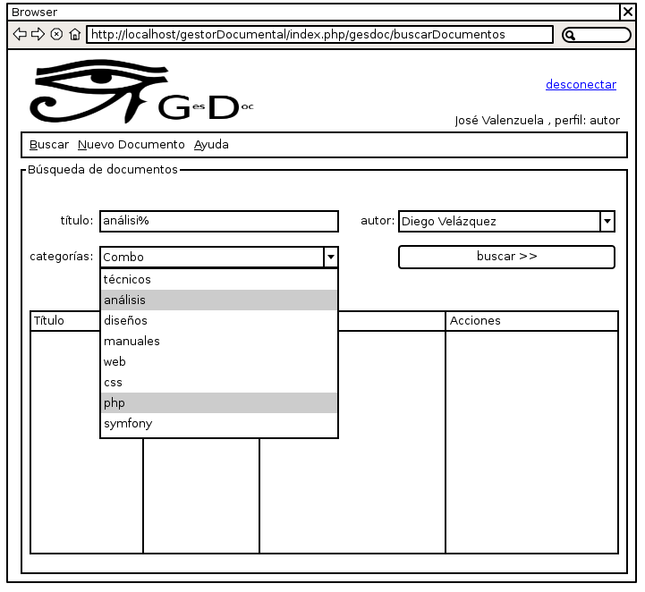

Subida de documentos
^^^^^^^^^^^^^^^^^^^^

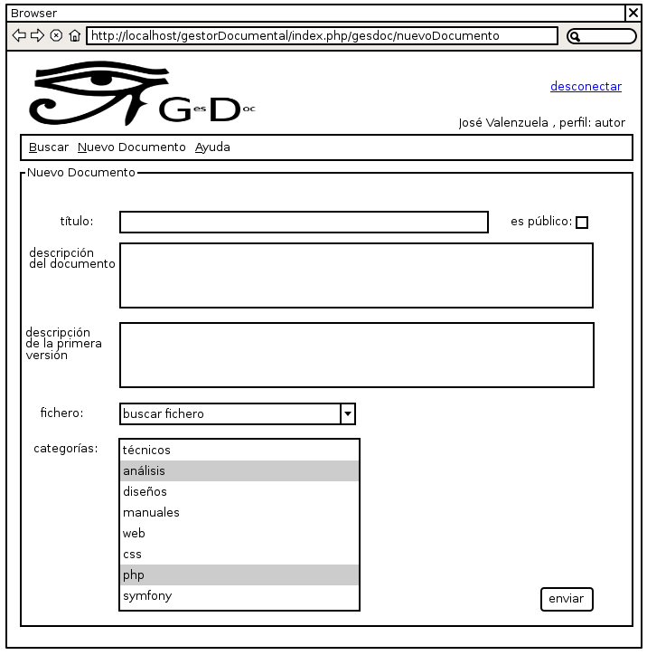

Subida de nuevas versiones de los documentos
^^^^^^^^^^^^^^^^^^^^^^^^^^^^^^^^^^^^^^^^^^^^

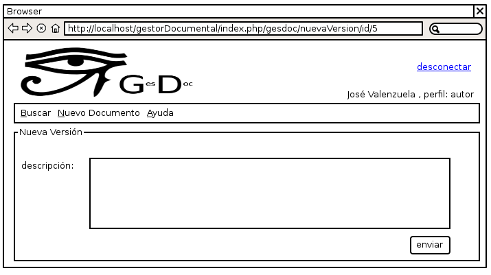

Modificación de los metadatos de un documento
^^^^^^^^^^^^^^^^^^^^^^^^^^^^^^^^^^^^^^^^^^^^^

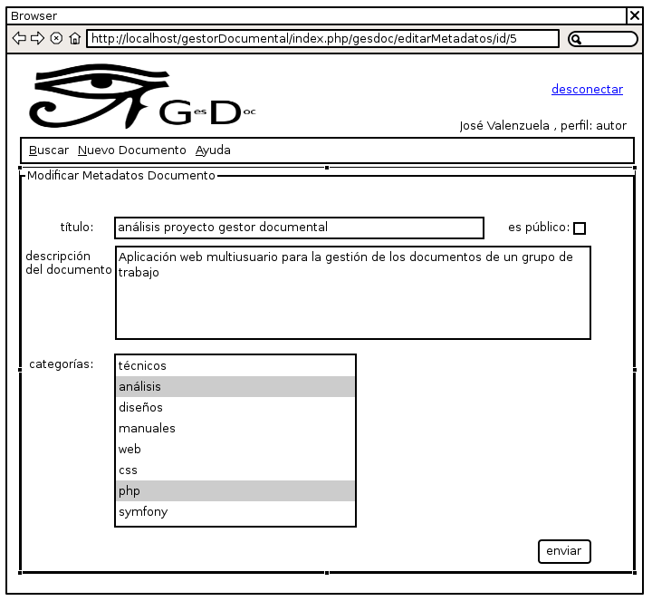

Añadir un comentario a una versión
^^^^^^^^^^^^^^^^^^^^^^^^^^^^^^^^^^

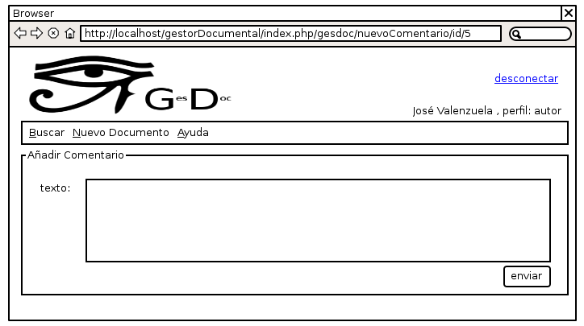

Valorar una versión.
^^^^^^^^^^^^^^^^^^^^

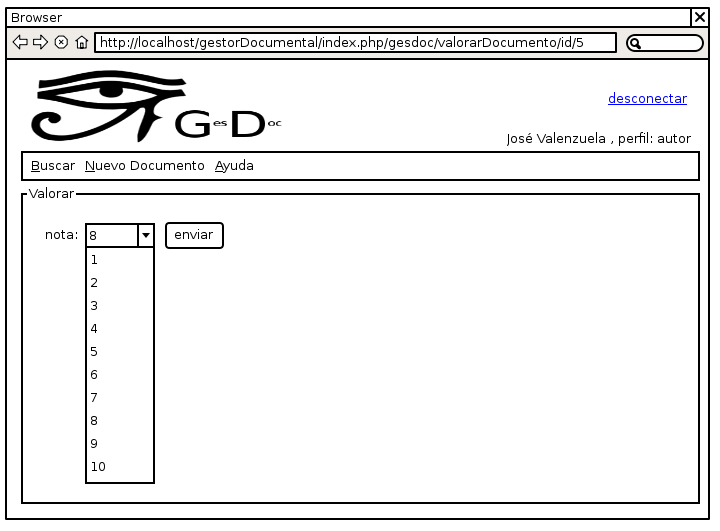

Gestión de Usuarios
^^^^^^^^^^^^^^^^^^^

**Listado**

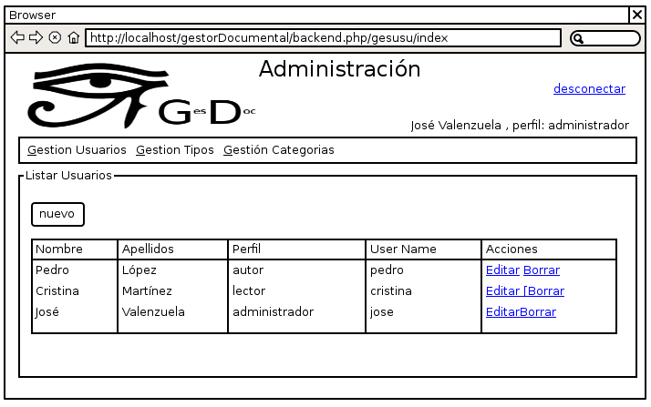

**Edición/Creación**

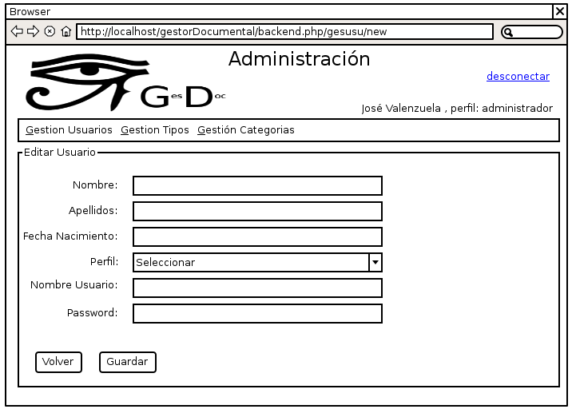

Gestión de Categorías y Gestión de Tipos de Archivos
^^^^^^^^^^^^^^^^^^^^^^^^^^^^^^^^^^^^^^^^^^^^^^^^^^^^

La gestión de categorías y de tipos de archivos tendrá un aspecto análogo a la
gestión de usuarios, diferenciándose simplemente en que los datos que se 
manipulan son los de la tabla que corresponda.

Diseño arquitectónico.
----------------------------------

El diseño arquitectónico de la aplicación está determinado por la arquitectura 
de *symfony*. En este apartado decidiremos como agrupar las distintas acciones 
de la aplicación en módulos y aplicaciones en el sentido que les da *symfony* y
que ya hemos estudiado en el tema anterior.

Los requisitos de la aplicación sugieren la existencia de dos partes 
diferenciadas: por un lado tenemos el gestor documental en sí, cuyas 
funcionalidades pueden ser utilizadas en mayor o menor medida según el perfil 
que ostente el usuario, y por otro una parte de administración de entidades que 
utiliza dicho gestor documental, a saber: *usuarios, tipos de archivos permitidos*
y *categorías*, y que sólo puede ser accedida por los usuarios administradores. 

Esta división en dos partes; la aplicación en sí y la administración de la 
aplicación, es muy típica en el universo de la *web*, siendo los gestores de 
contenido los ejemplos más claros de aplicaciones *web* que presentan tal
organización. De hecho existe una terminología indicada para designar a cada una
de estas dos partes: a la parte de administración se le denomina **backend**,
mientras que a la aplicación en sí, a la parte pública, entendiendo como tal la
que puede ser usada por usuarios no administradores, se conoce como **frontend**. 

Este hecho nos sugiere que organicemos los módulos en dos aplicaciones distintas
que obviamente denominaremos *frontend* y *backend*. Como ya vimos en la unidad
anterior, cada aplicación tiene su controlador frontal, su configuración, su 
*layout* y, por supuesto, sus módulos propios, aunque las dos operen sobre la
misma base de datos que representa el nexo entre ambas.

Frontend: el gestor documental
^^^^^^^^^^^^^^^^^^^^^^^^^^^^^^

Esta aplicación constará de un sólo módulo que vamos a llamar *gesdoc* donde se
implementarán las acciones siguientes:

* buscar documentos
* listar documentos
* añadir nuevos documentos
* añadir nuevas versiones de documentos
* comentar documento
* valorar documento

Backend: administración del gestor documental
^^^^^^^^^^^^^^^^^^^^^^^^^^^^^^^^^^^^^^^^^^^^^^^^^^^^^^

Esta aplicación albergará los módulos dedicados a la administración o gestión de
las tablas *usuarios, tipos* y *categorias*. En todos los casos la gestión 
consiste en posibilitar al administrador la creación, recuperación, modificación
y eliminación de registros. Estas son las operaciones típicas que ofrece
cualquier *backend* sobre sus datos. De nuevo, dado que el patrón se repite 
extensivamente en multitud de aplicaciones, existe un término indicado para 
designar a este tipo de módulos: *CRUD*, que es un acrónimo de *Create, Retrieve,
Update* y *Delete*, es decir, crear, recuperar, actualizar y borrar; las cuatro
operaciones básicas que acabamos de proponer.

Otra de las herramientas que *symfony* ofrece es un generador automático de
módulos *CRUD* sobre las tablas del proyecto. Con una sola instrucción la tarea
*propel:generate-admin* construye un módulo completamente funcional mediante el
cual podemos realizar las cuatro operaciones anteriores sobre la tabla que 
hayamos seleccionado. Modificando mínimamente el código generado automáticamente 
adaptaremos los módulos a nuestras necesidades. 

Teniendo en consideración la existencia de esta potente herramienta, 
organizaremos la aplicación *backend* en tres módulos:

* gesusu: para la gestión de usuarios (*CRUD* sobre la tabla *usuarios*)

* gescat: para la gestión de categorías (*CRUD* sobre la tabla *categorias*)

* gestip: para la gestión de tipos de archivos (*CRUD* sobre la tabla *tipos*)

Estructuralmente los tres módulos serán idénticos e implementarán las siguientes
operaciones:

* listar registros

* filtrar registros (búsqueda)

* modificar un registro determinado

* eliminar un registro determinado

* añadir un nuevo registro.

Inicio de sesión. Los plugins de symfony
^^^^^^^^^^^^^^^^^^^^^^^^^^^^^^^^^^^^^^^^

Tanto para acceder a una y a otra aplicación; *frontend* y *backend*, es
preciso autentificarse facilitando el nombre de usuario y contraseña, a 
excepción del acceso invitado  al gestor documental (*frontend*) que permite
realizar búsquedas y mostrar los resultados de documentos públicos. Es decir, se
requiere alguna acción (o conjunto de acciones) que realice el proceso de 
autentificación y construya una sesión en el servidor con los datos persistentes 
relativos al usuario. De esa manera la aplicación sabrá qué puede permitir al 
usuario en función de su perfil, dónde debe almacenar los archivos que este envíe
al repositorio y otras decisiones que dependen del usuario que realiza la
petición.

El proceso que acabamos de esbozar se denomina **inicio de sesión**, y el
conjunto de acciones, es decir el módulo, que lo implemente debería ser común a
las dos aplicaciones. El problema es que, por lo que hasta ahora sabemos, cada
aplicación tiene sus propios módulos, no hay módulos comunes a dos aplicaciones.
Así pues la solución podría ser construir el módulo de inicio de sesión en una de
las aplicaciones (*frontend*, por ejemplo) y copiarlo tal cual en la otra 
(*backend*, entonces). Pero esta solución, aunque funcionaría perfectamente, 
chirría a cualquier programador que respete ciertas normas básicas, conocidas
como **buenas prácticas**, cuando realiza su trabajo. *Don't Repeat Yourself*
(principio *DRY*) reza la norma que nos indica que la anterior solución no es del 
todo buena. No te repitas. Si más adelante haces un cambio en el módulo de 
inicio de sesión, resolviendo un *bug* por ejemplo, tendrás que propagarlo a su
módulo gemelo una vez resuelto, con el coste de mantenimiento que  eso conlleva. 

De nuevo *symfony* nos ofrece una solución que encaja bien con las buenas 
prácticas de programación: los *plugins*. Esta facilidad permite extender las 
aplicaciones *symfony* con nuevas funcionalidades que han podido ser programadas, 
incluso, por terceros. Por lo general un *plugin* consiste en uno o más módulos
autónomos que pueden ser utilizados y **compartidos** por las aplicaciones de un
proyecto. Los *plugins* presentan la misma estructura que una aplicación, de 
hecho, la mayoría de los *plugins* comenzaron siendo aplicaciones que, dada su
utilidad, fueron generalizándose y terminaron convertidas en *plugins*, dando 
servicio a la comunidad de usuarios *symfony*, ya que estas criaturas pueden 
enviarse a un repositorio común y pueden incorporarse a nuestros proyectos 
*symfony* a través de la tarea *plugin:install* de la instrucción *symfony*. 

Por tanto, además de las aplicaciones *frontend* y *backend*, construiremos un 
*plugin* consistente en un único módulo encargado de llevar acabo el inicio de 
la sesión. Las dos aplicaciones harán uso del mismo módulo de inicio de sesión. 
De esta manera hemos evitado duplicar el código. Denominaremos al *plugin 
IniSesPlugin*, y al módulo *inises*.

Resumen del diseño arquitectónico
^^^^^^^^^^^^^^^^^^^^^^^^^^^^^^^^^

En la tabla siguiente realizamos un resumen del diseño arquitectónico de nuestro
gestor documental, es decir, la manera en que hemos organizado las acciones del
proyecto en módulos, aplicaciones y *plugins*, que es básicamente lo que *symfony*
nos permite decidir.

+--------------------+--------------------------+--------+------------------------+
|aplicación/plugin   | Descripción              |Módulos | Acciones               |
+--------------------+--------------------------+--------+------------------------+
|frontend(aplicación)|Es el gestor documental en| gesdoc |  búscar documentos     |
|                    |sí, tal y como lo ven sus |        +------------------------+
|                    |usuarios.                 |        |  listar documentos     |
|                    |                          |        +------------------------+           
|                    |                          |        |añadir nuevos documentos|
|                    |                          |        +------------------------+
|                    |                          |        |añadir nuevas           | 
|                    |                          |        |versiones de            |
|                    |                          |        |documentos              |
|                    |                          |        +------------------------+   
|                    |                          |        | comentar documento     |
|                    |                          |        +------------------------+                     
|                    |                          |        | Valorar documento      |
+--------------------+--------------------------+--------+------------------------+
|backend (aplicación)|Es la aplicación que      | gesusu | Listar y buscar        | 
|                    |utiliza el administrador  |        | usuarios               |
|   		     |para configurar el gestor |        +------------------------+
|	             |documental. Concretamente |        | Modificar usuario      |
|                    |para administrar los      |        +------------------------+
|                    |usuarios, las categorías y|        |  Eliminar usuario      |
|		     |los tipos de documentos   |        +------------------------+
|                    |que se pueden subir al    |        | Añadir nuevo usuario   |
|                    |sitio.                    |        |                        |
|                    |                          +--------+------------------------+
|                    |                          | gescat |Listar,buscar,modificar,| 
|                    |                          |        |eliminar,añadir         |
|                    |                          |        |categorias              |                    
|                    |                          |        +------------------------+
|                    |                          |        |Añadir nuevo tipo de    |         
+--------------------+--------------------------+--------+------------------------+
|sesionPlugin(plugin)|Es un plugin con un módulo| inises | Comprobar              |
|                    |para realizar el inicio de|        | autentificación del    |
|                    |sesión y que será         |        | usuario                |
|                    |utilizado por las dos     |        +------------------------+
|                    |aplicaciones anteriores.  |        | Construir la sesión de |
|                    |                          |        | usuario                |
|                    |                          |        +------------------------+
|                    |                          |        |Cerrar la sesión        |
+--------------------+--------------------------+--------+------------------------+
					  									

Recursos para la construcción de la aplicación
----------------------------------------------

`Aquí <http://recursos>`_ tienes disponible los siguientes recursos que necesitarás para seguir
el resto del curso:

* Un volcado de la base de datos con la estructura y algunos datos de ejemplo.

* Algunos documentos que se corresponden con los ficheros asociados a las
  versiones de ejemplo de la anterior base de datos.

* Las *CSS's* que utilizaremos para presentar las pantallas de la aplicación de
  una manera similar a la propuesta en los bocetos de esta unidad.

* Las imágenes utilizadas por las *CSS's* y por algunas plantillas de la 
  aplicación.

Conclusión
----------

En esta unidad hemos realizado un análisis de la aplicación cuya construcción
nos servirá durante el resto del curso para aprender cómo utilizar *symfony* para
construir aplicaciones *web* de *calidad*. Hemos planteado un catálogo de 
requisitos, un modelo de datos, un procedimiento para la subida de archivos y 
hemos propuesto unos bocetos de las pantallas de la aplicación. También hemos 
planteado la estructura organizativa del código en dos aplicaciones; el *frontend*
que es la parte que se muestra a invitados, lectores y autores y que constituye
la aplicación en sí, el *backend*, que es la parte de administración, y un *plugin*
que implementará un procedimiento de inicio de sesión que será compartido por 
ambas aplicaciones.

.. note::

    Esta unidad no tiene ejercicios

.. raw:: html

   

   
    
   Desarrollo de Aplicaciones web con symfony 1.4 por Juan David Rodríguez García (juandavid.rodriguez@ite.educacion.es)
    
   se encuentra bajo una Licencia <a rel="license" href="http://creativecommons.org/licenses/by-nc-sa/3.0/">Creative Commons Reconocimiento-NoComercial-CompartirIgual 3.0 Unported</a>.
   </style>
   

